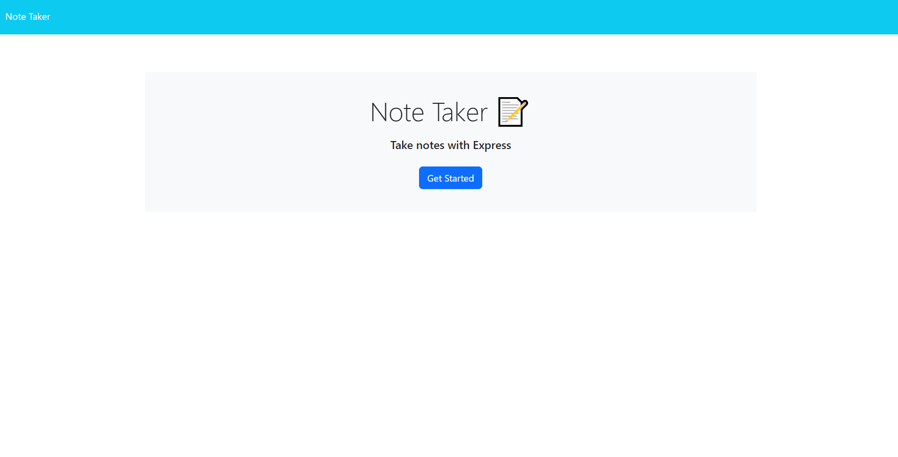
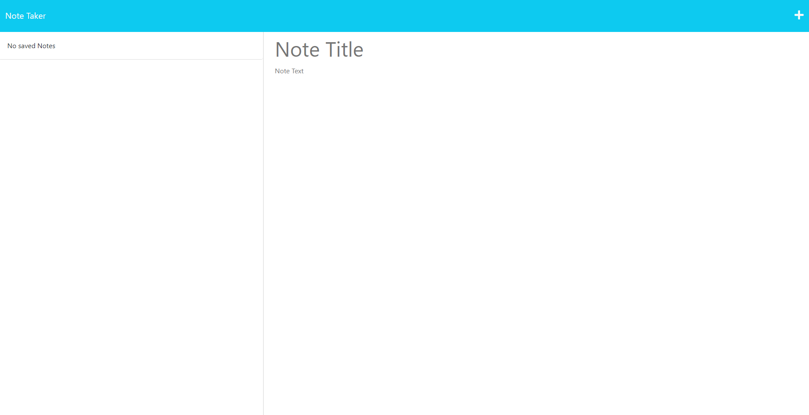
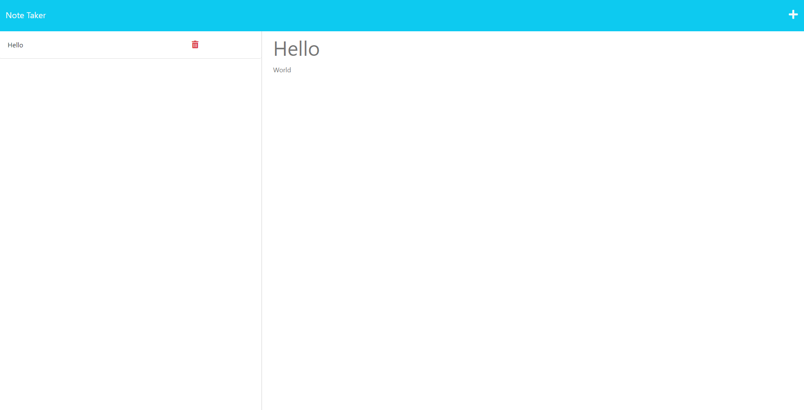

# Taking-Notes
;

## Description

I wanted to create an application that can be used to write and save notes. I saved and retrieve notes from a json file and used express.js for back-end.

## Table of Contents

- [Installation](#installation)
- [Usage](#usage)
- [Credits](#credits)
- [Author](#author)
- [License](#license)

## Installation
Go to the URL @ https://warm-forest-20500-4b1756da1857.herokuapp.com/

or

Clone the git repo: git@github.com:brownKasey/Taking-Notes.git

## Usage
If you cloned the git repo, then you'll need to open the terminal and change the directory to where the folder is. Once you've done that run, 'npm i' to install all of the dependencies neccesary for that cli to function. Then, once all the dependencies have been installed, you can run 'node server.js' it will run the server and provide you a link to the localhost port.

Or 

Go to the URL @ https://warm-forest-20500-4b1756da1857.herokuapp.com/

Once the proper steps have been taken, you will be greeted with this web page.

Click the 'Get Started' buttton. You'll be taken to the webpage below.

If you click into the 'Note Title' section you can enter a title for your note. Then click into the 'note text' section you can add a body to your note. Once you're done click the save icon in the top right corner and it will save your note. Your screen will look like the webpage below.

If you click the plus button, you'll be able to add another note. If you click on a previously saved note title you can view the old note title and body. If you click the trash can you will delete whatever note is next to it. 

## Credits

I would like to give credits to: 

Xandromus for providing the starter code.

https://github.com/coding-boot-camp/miniature-eureka

https://github.com/Xandromus

## Author

email: kaseyabrown28@gmail.com
github: https://github.com/brownKasey

## License

This project is using the Mit License. 
